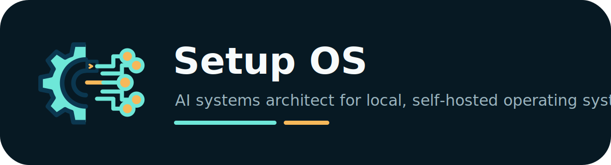

<p align="center">
  
</p>

# Setup OS

<p align="center">
  <a href="https://github.com/setup-os-labs/setup-os/actions/workflows/ci.yml"></a>
  <a href="LICENSE"></a>
  <a href="https://www.python.org/"></a>
  <a href="docs/architecture-principles.md"></a>
</p>

<p align="center">
  <a href="https://github.com/setup-os-labs/setup-os/stargazers"></a>
  <a href="https://github.com/setup-os-labs/setup-os/forks"></a>
  <a href="https://github.com/setup-os-labs/setup-os/issues"></a>
  <a href="https://github.com/setup-os-labs/setup-os/releases"></a>
</p>

Setup OS turns finalized AI planning conversations into local, self-hosted operating systems.

It is not another agent framework. It is an AI systems architect: it extracts intent from a planning conversation, checks whether existing tools can solve the problem, selects open-source components, proposes an architecture, generates a local repo, and keeps future changes behind reviewable evolution proposals.

Brand assets are in [docs/brand.md](docs/brand.md).

## Product Thesis

```text
Planning conversation
  -> spec completeness check
  -> component discovery
  -> architecture proposal
  -> user approval
  -> local repo generation
  -> running vertical OS
  -> future conversation-driven evolution
```

The first proof vertical is a local Portfolio Manager Agent. It is alert-only in v0: no Robinhood execution, no broker credentials, and no automated trades.

## Open Core Model

The open-source core includes:

- Setup OS CLI
- conversation ingestion
- spec extraction schemas
- architecture proposal generator
- local deployment templates
- blueprint system
- basic notification adapter interfaces
- audit log and evolution proposal flow
- starter vertical blueprints

Future commercial layers may include:

- hosted control plane
- encrypted sync
- managed always-on runners
- mobile app
- template marketplace
- premium vertical packs
- one-click cloud deployment
- team and enterprise governance

See [docs/open-core-strategy.md](docs/open-core-strategy.md).

## v0 Scope

Build one thin end-to-end path:

```text
Markdown/TXT planning conversation
  -> agent_spec.json
  -> architecture.md
  -> generated Portfolio Manager Agent
  -> daily Markdown report
  -> console notification
  -> evolution_proposal.md for future updates
```

Acceptance target:

```bash
python -m setup_os.cli create examples/portfolio_conversation.md
python -m setup_os.cli evolve examples/portfolio_update.md
python -m setup_os.cli apply --output generated/setup-os-agent --approve
```

Generated systems include `verify.py` so the scaffold can be checked with:

```bash
python verify.py
```

See [docs/roadmap.md](docs/roadmap.md) and [TASKS.md](TASKS.md).

For conversation structure and vertical planning templates, see [docs/conversation-planning-guide.md](docs/conversation-planning-guide.md) and [templates/conversation-guides/](templates/conversation-guides/). For the long-term update loop, see [docs/evolution-model.md](docs/evolution-model.md), [docs/notification-os.md](docs/notification-os.md), and [docs/agnostic-architecture.md](docs/agnostic-architecture.md).

## Tech Stack

<p>
  
  
  
  
  
  
</p>

- Core engine: Python 3.12+ standard library.
- CLI: `argparse` entrypoint at `python -m setup_os.cli`.
- Specs and state: JSON files, JSONL audit logs, JSONL timelines, and Markdown proposals.
- Generated agents: local Python scaffolds with sample data, reports, notifications, `verify.py`, and release metadata.
- Tests: stdlib `unittest` with GitHub Actions.
- Current adapters: Markdown/TXT conversation import, read-only holdings, transactions, cash, watchlist, and market snapshot CSV import, console notifications, local notification inbox, optional disabled-by-default ntfy push.
- Planned adapters: Apprise, MCP-style connectors, richer schedulers, and additional vertical blueprints.

## App Direction

Setup OS is CLI-first for the engine, but the product should become desktop-first before Portfolio Management OS is built as the first real vertical.

- Core: Python engine and CLI.
- Desktop shell: Tauri v2 + React + TypeScript.
- Python process mode: CLI subprocess in development, bundled Python sidecar for desktop releases; FastAPI only if the desktop shell needs a long-running local service.
- Local data: files and JSONL first; SQLite when the desktop needs indexed local state.
- Always-on runtime: personal node first, such as a Mac mini, NAS, mini PC, spare laptop, or private VPS, for schedulers, watchers, and phone notification dispatch.
- First desktop surface: richer vertical agent launcher and dashboard shell.
- First generated vertical: [Portfolio Management OS](docs/portfolio-management-os.md).
- Current checkpoint: [Product status](docs/product-status.md).
- Visual roadmap: [Development and release timeline](docs/development-release-timeline.md).
- Unsigned release artifact testing: [Desktop release testing](docs/desktop-release-testing.md).
- Packaged app smoke tests: [Packaged app smoke tests](docs/packaged-app-smoke-tests.md).
- Signing and notarization: [Desktop signing and notarization](docs/desktop-signing-notarization.md).
- Python sidecar packaging: [Python sidecar packaging](docs/python-sidecar-packaging.md).
- Sidecar release workflow scaffold: [Sidecar release workflow scaffold](docs/sidecar-release-workflow-scaffold.md).
- Runtime node scheduling: [Runtime node scheduling](docs/runtime-node-scheduling.md).

See [ADR 0004](docs/adr/0004-desktop-app-stack.md) for the desktop stack decision and [ADR 0006](docs/adr/0006-personal-runtime-node.md) for the personal runtime node decision.

## Repository Layout

The repo is intentionally a monorepo through MVP. Use it for the actual system while the architecture is still evolving; split repos only when a folder becomes a product, API, or community surface of its own.

Current MVP layout:

```text
setup-os/
  .github/                  GitHub issue, PR, and CI configuration
  apps/                     user-facing applications
    desktop/
    web/
    cli/
  packages/                 shared system packages
    core/
    schemas/
    agent-runtime/
    conversation-import/
    blueprint-engine/
    component-registry/
    policy/
  templates/                generated-system templates and blueprints
  docs/                     product, architecture, roadmap, and decisions
  examples/                 example conversations and generated outputs
  research/                 component research and stack-selection notes
  setup_os/                 temporary Python import package for v0 CLI compatibility
  tests/                    future pytest suite
  TASKS.md                  active Codex task queue
  CHANGELOG.md              release history
  CODEX.md                  AI-native development workflow
```

See [ADR 0001](docs/adr/0001-open-core-monorepo.md) for the eventual repo split policy.

Docs stay repository-native Markdown through MVP. See [ADR 0005](docs/adr/0005-docs-site-timing.md) for the docs-site timing decision.

## Development Workflow

Use short-lived branches and PRs for every meaningful change.

- Branch format: `codex/<short-task-name>`
- PR size: one task or one coherent vertical slice
- Merge requirement: tests pass, docs updated, changelog updated when user-facing behavior changes
- Architecture changes: add or update an ADR in `docs/adr/`

See [CONTRIBUTING.md](CONTRIBUTING.md), [CODEX.md](CODEX.md), and the [ADR index](docs/adr/README.md).

## License

Apache License 2.0. See [LICENSE](LICENSE).
