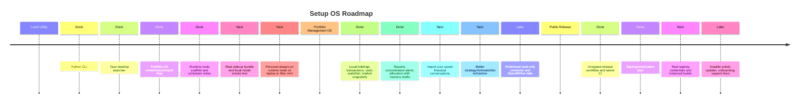
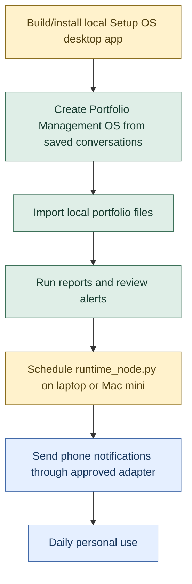
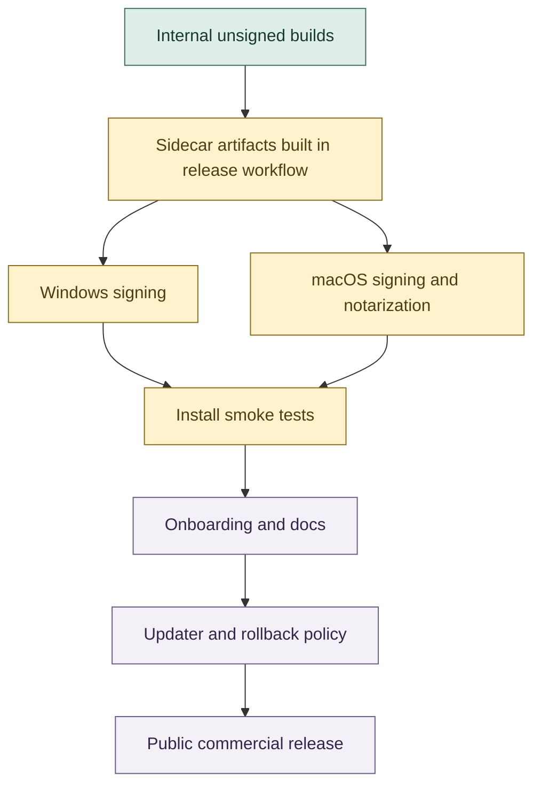

# Development and Release Timeline

This page is a visual guide for understanding where Setup OS is, what remains before it is comfortable as a personal local utility, and what comes later for a public commercial release.

## Current Position

```mermaid
flowchart LR
    A["Foundation\nCLI, docs, monorepo, CI"] --> B["Generated Portfolio OS\nlocal CSV imports, reports, alerts"]
    B --> C["Desktop MVP scaffold\nTauri shell, actions, diagnostics"]
    C --> D["Local utility readiness\nsidecar path, release checks, scheduler notes"]
    D --> E["Personal daily use\nreal sidecar artifacts, local install, runtime node"]
    E --> F["Public commercial release\nsigned installers, onboarding, updater"]

    C:::done
    D:::current
    E:::next
    F:::later

    classDef done fill:#dfeee7,stroke:#3b7058,color:#173b2f;
    classDef current fill:#fff2cc,stroke:#8a6d1d,color:#4f3f10;
    classDef next fill:#e5efff,stroke:#4169a8,color:#17365d;
    classDef later fill:#f3f0f7,stroke:#6d5a88,color:#352448;
```

Setup OS is at the **95% local-first desktop MVP scaffold** checkpoint. That means the architecture, desktop shell, generated Portfolio OS loop, CI, release notes, and packaging contracts exist. It does **not** mean the public installer is done.

## Three Timelines

## Product Tracks

| Track | Current % | Meaning | Next Blocker |
| --- | ---: | --- | --- |
| Setup OS local desktop MVP scaffold | 95% | The local-first desktop product shape is mostly in place and verified by CI. | Build real bundled Python sidecar artifacts and test them locally. |
| Setup OS as your daily local utility | 70% | You can generate and inspect a Portfolio OS, but the install/runtime path still needs polish. | Installable local app plus runtime-node schedule on your machine or Mac mini. |
| Generated Portfolio Management OS local v0 | 65% | Local data imports, reports, alerts, and memory drafts exist. | Use your saved financial conversations and improve extraction quality. |
| Public commercial release | 35% | Architecture, CI, release docs, and unsigned builds exist. | Signing, notarization, onboarding, updater, and support surface. |

## Local Utility Path

The local utility is close, but the missing piece is not more architecture. It is the practical install-and-run loop:

- package the app with a real Python sidecar;
- run the packaged app on your machine;
- create Portfolio Management OS from your saved conversations;
- schedule `runtime_node.py` somewhere always on;
- connect phone notifications in an explicitly approved way.

## Public Release Path

The public release is a separate path from your local utility. It needs more polish because other users will not tolerate setup friction, missing credentials, unsigned install warnings, or unclear onboarding.

## Next Milestones

| Milestone | Target | Done When |
| --- | --- | --- |
| Local install loop | Personal use | You can launch the desktop app from an installed artifact without relying on repo dev commands. |
| Portfolio from your conversations | Personal use | Your saved ChatGPT financial conversations import and produce reviewable strategy/risk/watchlist drafts. |
| Runtime node in the home setup | Personal use | A laptop, Mac mini, mini PC, or private VPS runs scheduled `runtime_node.py` and logs cycles. |
| Phone notifications | Personal use | Approved alert events can reach your phone without giving broad automation permissions. |
| Public beta package | Commercial release | Windows/macOS artifacts are signed/notarized, documented, and smoke-tested. |

## What To Build Next

1. Real sidecar artifact assembly in the desktop release workflow.
2. Packaged local install smoke test on your Windows machine.
3. Import and extract from your real saved Portfolio Management conversations.
4. Personal runtime-node setup guide for your chosen always-on machine.
5. Phone notification adapter decision and first approved channel.

## Current Automated Smoke Test

CI now runs `python scripts/smoke_local_utility.py`, which verifies the local repo path can:

- generate Portfolio Management OS from the bundled planning conversation;
- run generated health and report commands;
- run `runtime_node.py`;
- import a saved conversation example;
- extract structured memory drafts;
- verify the generated report and runtime files exist.

This is not the same as an installed desktop-app smoke test, but it protects the core local utility loop while packaging work continues.

The desktop launcher also exposes this as **Local smoke test**, so you can run the same validation interactively from the app while iterating locally.
