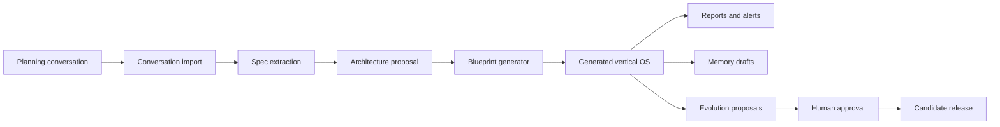
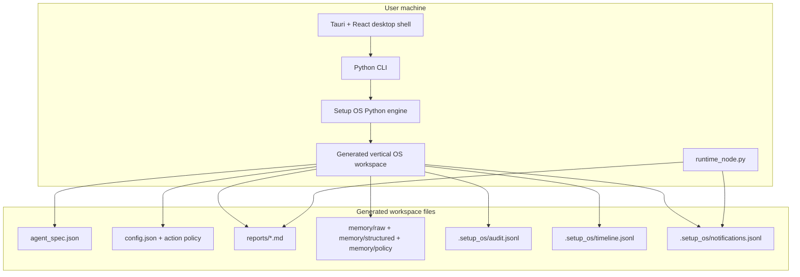
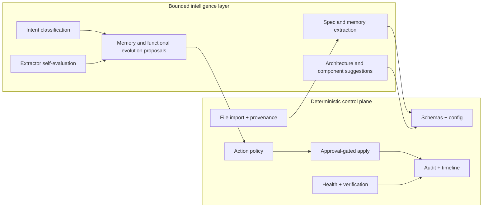
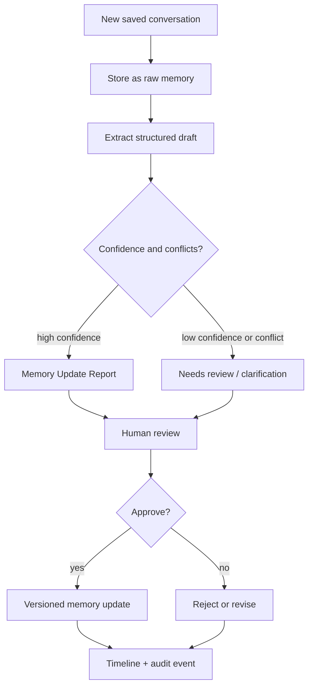
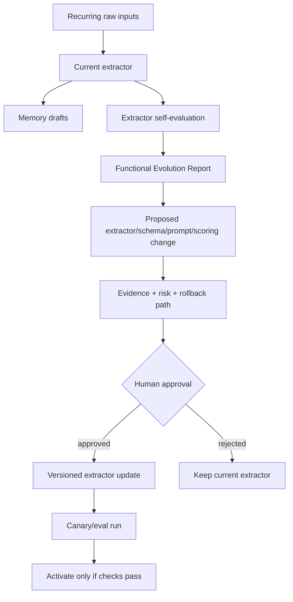
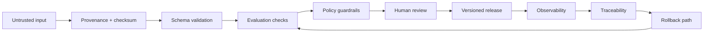
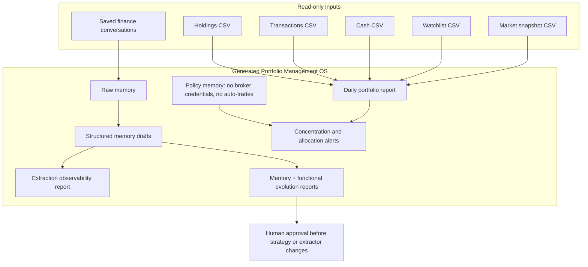

# Setup OS System And AI Design Interview Guide

This guide is for presenting and defending Setup OS in system design, AI engineering, and product architecture interviews.

## One-Minute Pitch

Setup OS turns finalized AI planning conversations into local, reviewable operating systems for a personal domain such as portfolio management, health, learning, career, home, or vehicle operations.

The product is not a generic chatbot and not an autonomous agent framework. It is an AI systems composer. It imports a planning conversation, extracts a structured spec, chooses a local-first architecture, generates a runnable vertical OS, and keeps future changes behind human-reviewed evolution proposals.

The core design choice is a deterministic control plane around a bounded intelligence layer:

```text
Conversation
  -> deterministic import and provenance
  -> spec extraction
  -> architecture proposal
  -> generated local system
  -> reports, alerts, memory drafts, observability
  -> human approval
  -> candidate release
```

For high-risk domains such as finance and health, Setup OS starts at advisory or alert-only maturity. It does not silently mutate strategy, execute trades, change medical instructions, or rewrite extractors without review.

## Problem

People now do serious planning in AI conversations, but most outputs disappear into chat history. The user gets good advice, but not a durable local system.

Setup OS addresses this gap:

- preserve the planning conversation as source evidence
- extract durable requirements and policy from it
- generate a local working system instead of another static document
- keep future changes reviewable, auditable, and reversible
- let the user gradually move from report-only to alerting to approved actions

The first serious proof vertical is Portfolio Management OS: a local, alert-only investing assistant that imports saved conversations and read-only CSV snapshots, writes reports, produces notifications, and creates review-only memory and functional evolution artifacts.

## Requirements

### Functional Requirements

- Import Markdown, TXT, or JSON planning conversations.
- Normalize conversations into role-based messages with provenance.
- Extract an `agent_spec.json` with name, slug, inputs, outputs, runtime, storage, privacy, notifications, and safety constraints.
- Generate an `architecture.md` proposal with selected components, alternatives, capability dependencies, and approval gates.
- Generate a local vertical OS scaffold with config, Agent DNA, reports, notifications, health checks, handoff, memory folders, audit logs, timelines, and verification commands.
- Generate a standard three-diagram pack: Overview Orchestration, Runtime Architecture, and Evolution / Safety Flow.
- Import future conversations into raw memory without mutating behavior.
- Extract structured memory drafts as review-only outputs.
- Produce Memory Update Reports, Functional Evolution Reports, and Extraction Observability Reports.
- Create evolution proposals from update conversations and require explicit approval before candidate releases.
- Support desktop operation through a Tauri + React shell that invokes the Python engine.

### Non-Functional Requirements

- Local-first by default.
- Provider-neutral across model, conversation source, storage, scheduler, notification channel, runtime, and deployment target.
- Human approval for risky action and system evolution.
- Traceability from durable claims back to source conversations, checksums, and evidence locations.
- Auditable JSONL timelines and event logs.
- Small, testable, file-based MVP before heavier databases or cloud services.
- Windows-first local operation for the current user path, while preserving macOS and Linux compatibility.
- Open-core friendly: core engine and vertical scaffolds are OSS; future hosted sync, managed runners, mobile, and marketplaces can become commercial layers.

## High-Level Architecture

```text
User planning conversation
  -> Conversation import layer
  -> Spec extraction layer
  -> Architecture and component-selection layer
  -> Blueprint generator
  -> Generated vertical OS
  -> Desktop shell / CLI / runtime node
  -> Reports, alerts, memory drafts, evolution proposals
```

## Mermaid Diagrams For Interviews

Use these diagrams as drawing templates. In a live interview, start with the simple overview, then add the deterministic/intelligence boundary and the evolution safety loop when the interviewer asks about AI production concerns.

### 1. Simple System Overview



How to explain it:

- The conversation is input, not trusted state.
- Setup OS compiles the conversation into files, architecture, and a runnable local system.
- Future changes are proposals until approved.

### 2. Runtime Container View



How to explain it:

- The desktop is a local operator surface, not the source of truth.
- The Python engine and generated files are the durable system.
- JSON, JSONL, Markdown, and local folders keep the MVP inspectable before introducing heavier infrastructure.

### 3. Deterministic Control Plane Vs Intelligence Layer



How to explain it:

- Deterministic code owns permissions, persistence, validation, releases, and audit.
- AI owns interpretation and proposal generation.
- In high-risk domains, AI does not own final authority.

### 4. Evolution And Safety Loop



How to explain it:

- Raw memory is never directly promoted.
- Structured memory is draft-first.
- Human approval converts a draft into durable memory.

### 5. Self-Evolving Extraction Loop



How to explain it:

- The system can learn how to learn better, but cannot rewrite itself silently.
- Memory evolution and functional evolution are separate paths.
- Extractor changes need evidence, evaluation, versioning, and rollback.

### 6. Production AI Controls



How to explain it:

- Production AI is not only model quality.
- The production system needs provenance, validation, evals, guardrails, review, observability, traceability, and rollback.
- This loop is what makes the OSS defensible beyond a demo.

### 7. Portfolio Management OS Example



How to explain it:

- Portfolio v0 is advisory and alert-only.
- Data imports are read-only local files.
- Broker execution and credential storage are explicitly out of scope until approval, rollback, and connector security mature.

### 1. Conversation Import Layer

The import layer reads Markdown/TXT/JSON-style conversation exports and normalizes messages into a `ConversationEnvelope`.

Current implementation:

- `setup_os/conversation.py`
- role normalization for `user`, `assistant`, `codex`, `claude`, and `system`
- source metadata with path, filename, type, parser, and message count

Design purpose:

- keep raw input separate from structured memory
- preserve provenance before any extraction happens
- make future providers pluggable: ChatGPT, Claude, Cursor, Gemini, Markdown, TXT, JSON, or connector exports

### 2. Spec Extraction Layer

The v0 extractor is intentionally deterministic and simple. It classifies known verticals such as Portfolio Manager or Health OS based on conversation text and emits a structured `AgentSpec`.

Current implementation:

- `setup_os/spec.py`
- portfolio and health blueprint detection
- safety defaults such as no broker credentials, no automated trades, no diagnosis, and no medication changes

Interview defense:

The early version uses deterministic extraction because correctness and explainability matter more than model cleverness at the foundation. A future LLM extractor can improve coverage, but it should emit schema-constrained drafts with confidence, evidence, and conflicts instead of directly mutating system behavior.

### 3. Architecture Proposal Layer

Setup OS treats architecture as a product artifact. The architecture layer writes a proposal that explains runtime, component choices, rejected alternatives, capability dependencies, and approval gates.

Current implementation:

- `setup_os/architecture.py`
- `setup_os/capabilities.py`
- `setup_os/registry.py`
- `docs/architecture-principles.md`
- `docs/agnostic-architecture.md`

Design purpose:

- make architecture reviewable by humans
- avoid hidden agent magic
- justify dependencies
- preserve why decisions were made

### 4. Blueprint Generator

The blueprint generator creates a local vertical OS scaffold. For Portfolio Management OS, this includes CSV importers, reports, notifications, memory import/extraction, observability reports, health checks, runtime-node support, handoff guidance, and policy config.

Current implementation:

- `setup_os/blueprints.py`
- `templates/blueprints/portfolio-management-os.md`
- `docs/portfolio-management-os.md`

Generated files include:

- `agent_spec.json`
- `architecture.md`
- `agent_dna.json`
- `config.json`
- `verify.py`
- `health.py`
- `runtime_node.py`
- `handoff.py`
- `import_conversation.py`
- `extract_memory.py`
- `memory_update_report.py`
- `functional_evolution_report.py`
- `extraction_observability.py`
- `report.py`
- `.setup_os/audit.jsonl`
- `.setup_os/timeline.jsonl`
- `.setup_os/notifications.jsonl`

### 5. Evolution And Approval Layer

Future conversations do not directly mutate generated agents. They produce an `evolution_proposal.md` with confidence, impact, risk, memory layer, conflicts, and approval requirement.

Current implementation:

- `setup_os/evolution.py`
- `setup_os/cli.py create`
- `setup_os/cli.py evolve`
- `setup_os/cli.py apply --approve`
- `setup_os/audit.py`
- `setup_os/timeline.py`
- `docs/evolution-model.md`
- `docs/adr/0007-self-evolving-extraction-engine.md`

Design purpose:

- separate suggestion from activation
- make changes auditable
- prevent raw chat exports from becoming trusted memory
- allow rollback and versioned releases before limited automation

### 6. Runtime Surfaces

Setup OS has three practical surfaces:

- CLI: Python engine for create, evolve, apply, smoke tests, reports, and verification.
- Desktop: Tauri + React shell for daily Work, Review, and Operator surfaces.
- Runtime node: a local or personal always-on machine that runs generated agents on a schedule and dispatches notifications.

The current product is local-first. A hosted control plane is a future open-core layer, not a dependency for the MVP.

## Current Concrete Flow

```text
python -m setup_os.cli create examples/portfolio_conversation.md
  -> parse conversation
  -> extract Portfolio Manager Agent spec
  -> write agent_spec.json
  -> write architecture.md
  -> write diagram pack
  -> generate Portfolio blueprint
  -> write release snapshot
  -> append timeline and audit events

python -m setup_os.cli evolve examples/portfolio_update.md
  -> parse update conversation
  -> create reviewable evolution_proposal.md
  -> append timeline and audit events

python -m setup_os.cli apply --approve
  -> require explicit approval flag
  -> create v2 candidate release
  -> append timeline and audit events
```

## Deterministic Vs Non-Deterministic Design

Setup OS deliberately separates deterministic control from non-deterministic intelligence.

### Deterministic Components

These should be predictable, testable, and repeatable:

| Area | Examples | Why deterministic |
| --- | --- | --- |
| File import | reading conversation files, storing raw exports, computing checksums | provenance must be stable |
| Parsing and normalization | role extraction, message envelopes, source metadata | repeatability and debugging |
| Schema writing | `agent_spec.json`, `config.json`, `agent_dna.json` | downstream tools need stable contracts |
| Blueprint generation | writing folders, scripts, reports, verifiers, diagrams | generated systems must be reproducible |
| Policy primitives | trust levels, prohibited actions, approval-required actions | safety cannot depend on model mood |
| Health checks | required file checks, config checks, notification JSONL validation | production readiness needs hard pass/fail |
| Audit and timeline | append-only JSONL event records | traceability and incident review |
| Apply gate | `--approve` required for candidate releases | explicit human authorization |
| CSV import validation | required columns, numeric checks, read-only manifests | financial data quality and safety |
| CI and smoke tests | unit tests, desktop contract checks, local utility smoke tests | regression prevention |

### Non-Deterministic Or Intelligence Components

These are where AI or heuristic interpretation creates value, but must be bounded:

| Area | Current or future intelligence | Guardrail |
| --- | --- | --- |
| Spec extraction | infer desired vertical, inputs, outputs, constraints, and safety rules from a conversation | schema-constrained output, confidence, missing decisions |
| Component selection | recommend stack choices and alternatives | architecture proposal with rejected alternatives |
| Memory extraction | turn raw conversations into facts, goals, preferences, risk rules, and watchlists | review-only drafts with source evidence |
| Intent classification | distinguish curiosity, serious consideration, rejected ideas, approved strategy, and active behavior | confidence gates and conflict checks |
| Functional evolution | suggest new extractors, schemas, scoring rubrics, contradiction checks, or filters | separate Functional Evolution Report and approval |
| Recommendation generation | alerts, warnings, daily summaries, future planning guidance | advisory/alert-only maturity in high-risk domains |
| Observability interpretation | summarize noisy lines, low-confidence drafts, conflicts, and gaps | raw metrics plus reviewable report |

Interview phrasing:

The deterministic layer owns permissions, provenance, persistence, validation, and release mechanics. The intelligence layer proposes interpretations and upgrades. It does not own final authority in high-risk workflows.

## AI System Design

### Model And Provider Strategy

Setup OS is provider-neutral by design. The architecture should support OpenAI, Anthropic, Gemini, local Ollama, vLLM, LM Studio, or future LLM providers behind an `LLMProvider` boundary.

Current v0 does not require a live model for its deterministic proof path. That is intentional. It proves the control plane, artifacts, and safety model before plugging in more powerful extraction.

Future LLM use should be:

- schema-constrained
- evidence-seeking
- confidence-scored
- replayable against saved inputs
- evaluated against gold conversations
- blocked from direct mutation or execution

### Memory Architecture

Setup OS separates memory into three layers:

- Raw memory: original conversations and notes. Never directly drives behavior.
- Structured memory: extracted facts, preferences, goals, thresholds, watchlists, and workflow rules.
- Policy memory: protected rules such as approval requirements and automation limits.

Policy memory is the highest-trust layer and should require stricter review than ordinary memory.

### Self-Evolving Extraction

The key AI systems idea is that generated systems can improve how they learn, but only through controlled proposals.

There are two separate evolution paths:

```text
Raw input
  -> memory extraction
  -> Memory Update Report
  -> human approval
  -> versioned memory update

Raw input
  -> extractor self-evaluation
  -> Functional Evolution Report
  -> human approval
  -> versioned extractor/schema/prompt update
```

This matters because a bad extractor can be more dangerous than a bad fact. It can repeatedly misclassify user intent, overfit to noisy conversations, or convert exploratory questions into active preferences.

## Production AI Concerns

### Security

Current and planned controls:

- local-first storage by default
- no broker credentials in Portfolio v0
- no automated trades
- no medical diagnosis or medication changes in Health OS
- local `.env` or OS keychain style secret boundaries for future connectors
- read-only imports before external execution
- disabled-by-default external notification channels such as ntfy
- provider-neutral design to avoid hard dependency on a single hosted model
- public release path that still needs signing, notarization, updater, and rollback hardening

Future production additions:

- threat model for prompt injection through imported conversations
- connector permission scopes and least-privilege tokens
- secrets scanning in CI
- encrypted local stores for sensitive verticals
- signed generated releases or manifest verification
- sandboxed tool execution for generated agents

### Evaluation

Current evaluation:

- unit tests across conversation import, spec extraction, architecture output, policies, blueprints, CLI, audit, diagrams, desktop shell, quality, and release contracts
- generated `verify.py` checks required vertical OS files
- generated `health.py` checks runtime readiness
- local utility smoke test validates create/report/runtime/import/extract loop
- desktop release contract checks packaging and sidecar expectations

Future AI evaluation:

- gold conversation set for each vertical
- extractor precision/recall against labeled memory items
- hallucination checks that require evidence for durable claims
- conflict-detection test cases
- intent-state classification tests
- regression tests for prompt and schema changes
- canary runs before approving new extractors
- human review metrics: accepted, rejected, edited, and reverted proposals

### Observability

Current observability:

- append-only `.setup_os/audit.jsonl`
- append-only `.setup_os/timeline.jsonl`
- `.setup_os/notifications.jsonl`
- generated runtime-node logs
- extraction observability reports with processed inputs, noisy lines, low-confidence drafts, conflicts, source checksums, and evidence locations
- desktop review surfaces for status, reports, handoff, notifications, runtime diagnostics, and generated Portfolio insights

Future observability:

- structured run IDs spanning import, extraction, report, notification, and approval
- per-extractor metrics
- latency and cost metrics for LLM calls
- model/version/prompt/schema fingerprinting
- failure dashboards for connector, scheduler, and notification errors
- drift monitoring for repeated low-confidence or rejected proposals

### Guardrails

Current guardrails:

- action trust levels: `read`, `alert`, `draft`, `approve`, `execute`, `auto_execute`
- portfolio policy starts at `alert`
- health policy starts at `alert`
- prohibited actions such as `auto_trade`, `store_broker_credentials`, `diagnose`, `change_medication`, and `handle_emergency`
- `apply` refuses to create a candidate release without `--approve`
- raw conversations are stored as raw memory first and do not mutate behavior
- structured memory drafts are marked `draft_requires_review`
- functional evolution is separate from memory updates

Future guardrails:

- model output validation with strict schemas
- policy-as-code checks before release creation
- dangerous-action classifier for generated tool calls
- approval workflows by risk tier
- rollback required before limited automation
- domain-specific constitutions for finance, health, legal, and career decisions

### Traceability

Current traceability:

- source path, filename, file type, parser, and message count on conversation envelopes
- raw conversation import manifests
- checksums for imported conversations in generated systems
- source names and paths in memory drafts
- evidence-linked memory update reports
- audit and timeline records for create, evolve, and apply actions
- generated architecture proposals and diagram manifests

Future traceability:

- span IDs across the full pipeline
- line-level evidence anchors for every durable extracted claim
- model, prompt, schema, and extractor version attached to every generated draft
- signed release manifests for approved generated-system versions

### Human-In-The-Loop Governance

The main governance rule is simple:

AI proposes. Humans approve.

This applies to:

- strategy changes
- policy changes
- schema changes
- prompt changes
- extractor changes
- maturity-level changes
- external actions
- candidate releases

This is why Setup OS is defensible for high-risk domains. It does not pretend the model is always right. It turns the model into a proposal generator inside a deterministic governance loop.

### Data Quality

Current controls:

- required CSV columns for portfolio imports
- row-level validation for dates, symbols, quantities, prices, fees, balances, and market snapshot prices
- import manifests for snapshots, transactions, cash, watchlists, and market data
- previous-file backups during imports
- raw memory before structured extraction
- low-confidence draft status for heuristic extraction
- conflict fields in evolution proposals

Future controls:

- duplicate detection across chat exports
- stale fact detection
- noisy conversation segment filtering
- contradiction checks between old policy and new claims
- source reliability scoring
- review queues for ambiguous low-confidence drafts

## Scaling Strategy

Setup OS should not start with web-scale microservices. The correct scaling path is maturity-first:

1. Local files, Markdown, JSON, and JSONL for inspectability.
2. SQLite when the desktop needs indexed state.
3. Personal runtime node for scheduled runs and phone notifications.
4. Optional vector store only when retrieval needs justify it.
5. Hosted sync or team control plane only after local workflows are trusted.

This is a product and safety decision. Personal operating systems are trust-heavy and user-specific. Scaling too early would add operational complexity before proving correctness, review UX, and rollback.

## Key Tradeoffs

### Deterministic v0 Extractor Vs LLM Extractor

Deterministic v0 is less flexible but easier to test, explain, and defend. A future LLM extractor improves recall but needs schemas, evidence, evals, prompt/version tracking, and approval gates.

### Local-First Vs Cloud-First

Local-first reduces privacy risk and makes generated systems inspectable. Cloud-first would improve sync and availability but increases security, cost, and trust burden. Setup OS keeps cloud as a future layer.

### File-Based State Vs Database

Files and JSONL are easy to inspect and diff. SQLite becomes useful when review queues, search, and historical analytics outgrow file scans.

### Human Approval Vs Automation

Approval slows the system down, but it is the right default for finance, health, and personal policy. Automation can be introduced later by action class, confidence, rollback maturity, and domain risk.

### Desktop Shell Vs Web App

The desktop shell fits a local-first product: it can call the local Python engine, inspect local workspaces, and package an end-user experience without requiring hosted infrastructure. A web app may come later for docs, collaboration, or managed hosted use.

## Defending The Design In Interviews

### If Asked: Why not just use LangChain or an agent framework?

Setup OS is not trying to replace orchestration frameworks. It composes systems and governance. LangGraph, PydanticAI, or other runtimes can become implementation choices behind a generated vertical. The unique value is the architecture artifact, approval model, local generation, evolution proposal loop, and traceability.

### If Asked: Where is the AI?

The AI is in interpreting messy planning conversations, extracting structured specs and memory, recommending component choices, generating architecture proposals, identifying conflicts, and proposing functional extractor upgrades. But authority stays in deterministic policy, approval, audit, and release mechanics.

### If Asked: How do you prevent hallucinations?

Durable claims should require source evidence. Raw conversations are not trusted memory. Structured outputs are drafts with confidence and evidence. High-risk changes require human approval. Future LLM extractors should be evaluated against labeled conversations and blocked by schema validation, conflict checks, and traceability requirements.

### If Asked: How would you evaluate this?

I would evaluate the deterministic control plane with unit tests and smoke tests. I would evaluate AI extraction with a gold set of conversations, measuring precision/recall for extracted facts, intent classification accuracy, conflict detection, evidence coverage, and human acceptance rate. I would also track rejected, edited, and reverted proposals to detect drift.

### If Asked: How does it become production-grade OSS?

The OSS core needs clear contracts, tests, docs, examples, release checks, security policy, reproducible local generation, and contributor-friendly architecture decisions. The AI layer needs eval datasets, schema validation, prompt/model versioning, observability, evidence maps, rollback, and domain-specific guardrails. Public release also needs signed installers, updater policy, sidecar Python packaging, and connector security.

### If Asked: What is the hardest technical risk?

The hardest risk is not generating files. It is preventing personal memory and policy drift as the system ingests recurring messy conversations. The design answers that by separating raw memory, structured memory, and policy memory; by separating memory updates from functional extractor upgrades; and by requiring evidence, observability, approval, versioning, and rollback.

## Current Maturity

Setup OS currently has a strong local desktop MVP scaffold, not a full public production release.

Current strengths:

- deterministic Python CLI
- Tauri desktop shell
- generated Portfolio OS scaffold
- read-only Portfolio data imports
- reports, notifications, health checks, runtime node, and handoff
- memory drafts, memory update reports, functional evolution reports, and extraction observability reports
- audit and timeline logs
- architecture docs and ADRs
- CI and smoke tests

Remaining production gaps:

- real bundled Python sidecar artifacts
- signed/notarized installers
- updater and rollback procedure
- richer desktop review for memory and functional evolution reports
- extractor versioning and rollback
- live read-only connector hardening
- AI evaluation harness and labeled datasets
- prompt/model/schema version tracking
- stricter security reviews for connectors and imported untrusted text

## Interview Close

The core insight behind Setup OS is that AI planning should not end as chat history. It should compile into a local, inspectable, governed system. The production-grade move is not to make the agent more autonomous immediately. It is to build the deterministic substrate around the intelligence: provenance, schemas, evals, guardrails, observability, traceability, human approval, versioning, and rollback.
